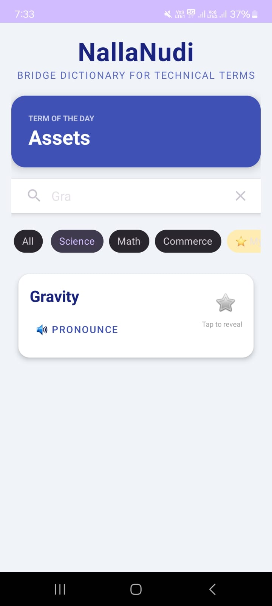
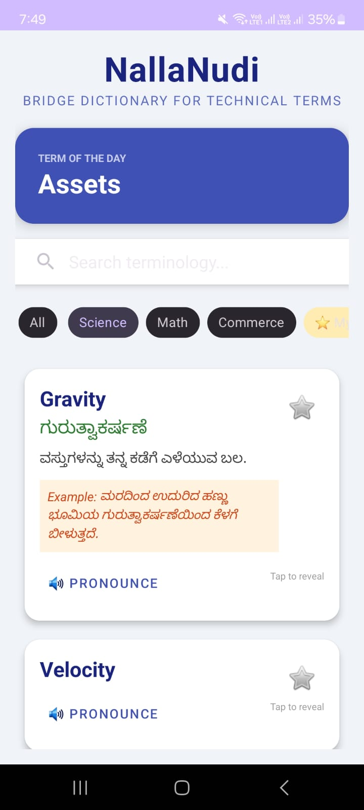
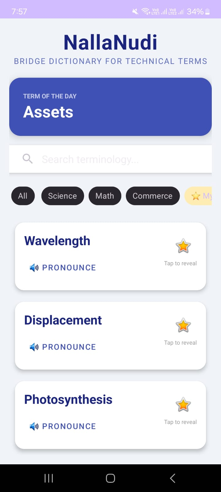
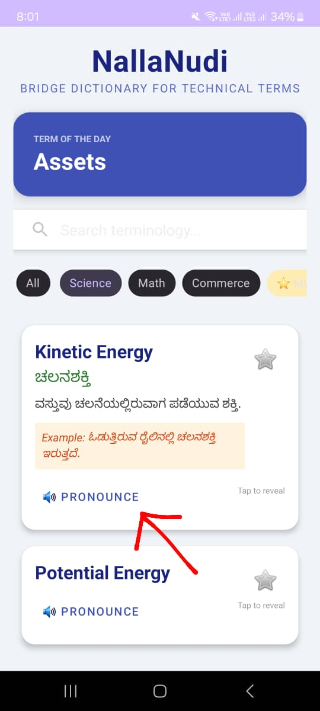

NallaNudi (ನಲ್ಲನುಡಿ)
Bridge Dictionary for Technical Terms

📝 Problem Statement

Students completing their primary and secondary education in Kannada-medium schools often encounter a significant "linguistic shock" when transitioning to English-medium higher education (PUC and Degree courses). While these students possess a deep conceptual understanding of academic subjects, their progress is frequently hindered by a sudden exposure to specialized technical vocabulary in Science, Math, and Commerce.
Standard bilingual dictionaries are often too broad and fail to provide the subject-specific, simplified Kannada context necessary for academic clarity. NallaNudi bridges this gap by providing an offline, contextual glossary with real-world examples and auditory guidance.

🚀 Features

Interactive Flashcards: Uses a "Tap to Reveal" mechanism to encourage active recall and better memory retention.
My List (Personalized Revision): Allows students to "Star" difficult terms to build a curated list for daily focused study.
Word of the Day: An automated module that highlights a new technical term every 24 hours to encourage incremental learning.
Auditory Voice Guide: Integrated Text-To-Speech (TTS) to help students master the correct English pronunciation.
Subject-Wise Filtering: Quick navigation through specific terminologies for Science, Mathematics, and Commerce.
100% Offline Availability: Built with a Room Database ensuring zero data usage, making it ideal for rural students.
Instant Search: High-performance retrieval engine optimized for response times under 200ms.

🛠️ Tech Stack

Language: Kotlin 1.9.22
Database: Room Persistence Library (SQLite Abstraction)
Concurrency: Kotlin Coroutines & Flow (for lag-free background operations)
UI Framework: XML with Material Design 3 (Cards, Chips, RecyclerView)
API: Native Android Text-to-Speech (TTS)
Architecture: Layered Architecture (Data, Logic, UI)

📥 Installation Steps

Clone the Repository:
code
Bash
git clone https://github.com/maha1819/NallaNudi-App.git

Open in Android Studio:
Launch Android Studio (Jellyfish or newer recommended).
Select Open and navigate to the cloned folder.

Configure JDK:
Go to File > Settings > Build, Execution, Deployment > Build Tools > Gradle.
Set Gradle JDK to jbr-21 or Java 17.

Sync Project:
Click the Blue Elephant icon (Sync Project with Gradle Files).

🏃 How to Run

Connect your Android device (Samsung Galaxy M53) via USB.
Enable USB Debugging in Developer Options.
Select your device in the top toolbar dropdown.
Click the Green Triangle (Run) button.

Alternatively, via terminal:
code
Bash
./gradlew installDebug

📸 Screenshots

## 📸 Screenshots

<table style="width: 100%;">
  <tr>
    <td align="center"><b>Home & Word of the Day</b></td>
    <td align="center"><b>Search & Filters</b></td>
    <td align="center"><b>Flashcard Reveal</b></td>
  </tr>
  <tr>
    <td align="center"></td>
    <td align="center"></td>
    <td align="center"></td>
  </tr>
  <tr>
    <td align="center"><b>My List (Favorites)</b></td>
    <td align="center"><b>Voice Guide</b></td>
    <td align="center"><b>-</b></td>
  </tr>
  <tr>
    <td align="center"></td>
    <td align="center"></td>
    <td align="center"></td>
  </tr>
</table>

📂 Folder Structure

code
Text

NallaNudi/

├── app/

│   ├── src/main/

│   │   ├── assets/             # words.json (Initial Dataset)

│   │   ├── java/com/example/nallanudi/

│   │   │   ├── MainActivity.kt # UI Logic, Search, Filters

│   │   │   ├── Word.kt         # Room Entity (Database Model)

│   │   │   ├── WordDao.kt      # SQL Queries

│   │   │   ├── WordDatabase.kt # DB Initialization & Migration

│   │   │   └── WordAdapter.kt  # Flashcard & List Management

│   │   └── res/layout/

│   │       ├── activity_main.xml # Dashboard Design

│   │       └── item_word.xml     # Word Card Design

└── build.gradle.kts            # Project Configuration

🔮 Future Improvements

Visual Aids: Adding diagrams and illustrations for STEM concepts.
Quiz Mode: Implementing a gamified MCQ section for self-testing.
Multilingual Support: Expanding the bridge to other regional languages.
Dark Mode: Providing a comfortable reading experience for night study.

